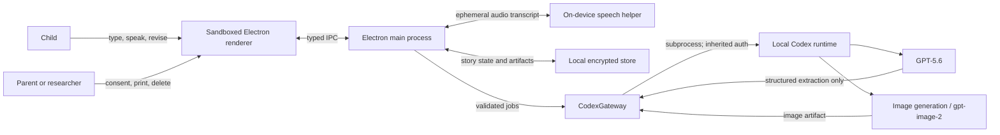
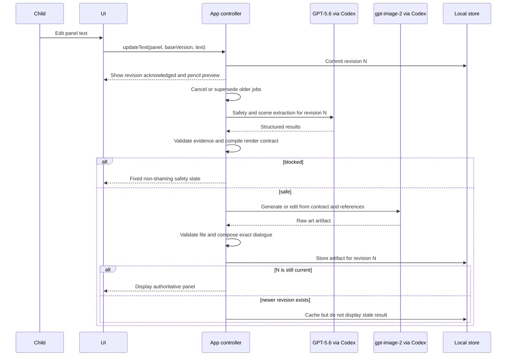

# Maliang — Technical Design Document

**Product name:** Maliang<br>
**Version:** 0.3<br>
**Status:** Draft for engineering review<br>
**Date:** July 16, 2026<br>
**Product source:** [`maliang-product-design-doc.md`](./maliang-product-design-doc.md)<br>
**Visual reference:** [`Web app design request-handoff.zip`](./Web%20app%20design%20request-handoff.zip)<br>
**Initial delivery target:** Phase 0 renderer study and Phase 1 Gym prototype on macOS

---

## 1. Executive summary

Maliang is a local-first comic-making prototype in which a child changes a
picture only by changing their own words. The system converts each panel's text
into an evidence-bound scene graph, compiles that graph into a literal render
contract, and asks the GPT image generation model to produce or edit the panel.
The application adds exact dialogue bubbles and other deterministic overlays
after image generation.

For the requested prototype, all model work runs through the parent's existing
Codex sign-in:

- **Text reasoning:** `gpt-5.6-terra`, selected explicitly for structured Codex
  tasks; `gpt-5.6-sol` orchestrates image generation.
- **Image generation:** Codex's built-in `$imagegen` capability, which currently
  uses `gpt-image-2`.
- **Authentication:** the local Codex process's cached ChatGPT sign-in. The
  application never reads, copies, logs, or transmits Codex credentials itself.

This is a valid architecture for a trusted, single-machine research prototype.
It is **not** the production serving architecture for a multi-user child-facing
product. OpenAI documents built-in Codex image generation as an interactive
capability and directs programmatic image generation to the Image API. Codex
subscription authentication must therefore remain behind a provider adapter
and pass a Phase 0 supportability test. A public launch will require a separate
deployment and commercial-auth decision.

The load-bearing engineering mechanism is not prompting. It is the combination
of:

1. an evidence-bound scene graph;
2. deterministic literalness rules;
3. a versioned render contract;
4. a reference-sheet and edit pipeline;
5. stale-job rejection; and
6. a benchmark that measures model helpfulness as a defect.

The largest unresolved risk is latency. The product requires an authoritative
panel update within five seconds, while Codex-auth image generation exposes no
documented application SLA. Phase 0 must measure this rather than assume it.

---

## 2. Goals

### 2.1 Product goals

- Make the gap between a child's intended scene and written scene visible.
- Cause revisions through visual consequence, not critique or scoring.
- Preserve the child's sole authorship of every story word.
- Hold a character's identity stable across five or six panels.
- Make unspecified visual properties visibly provisional in gray pencil.
- Make excessive description visibly cluttered rather than aesthetically
  summarized.
- Complete a target-scene Gym exercise or short comic in one sitting.

### 2.2 Technical goals

- Represent every concrete rendered detail with evidence from the child's text.
- Keep model-generated prose out of all child-facing UI.
- Use `gpt-5.6-terra`, `gpt-5.6-sol`, and `gpt-image-2` through local Codex ChatGPT authentication for
  Phase 0 and Phase 1.
- Return an immediate, truthful edit acknowledgement and target an authoritative
  updated panel within five seconds.
- Re-render the smallest practical visual scope after an edit.
- Keep raw audio ephemeral and use on-device transcription.
- Minimize stored child data and support complete local deletion.
- Make provider behavior replaceable without changing scene semantics or the UI.

### 2.3 Non-goals

- Grammar or spelling correction.
- Story, dialogue, title, description, or sentence generation.
- Autocomplete or suggested wording.
- Open-ended chatbot interaction.
- Social publishing or multiplayer.
- A production cloud backend in Phase 0 or Phase 1.
- A promise that ChatGPT/Codex plan usage can serve a public application.
- Solving narrative tension or reader response before Reader mode.

---

## 3. Engineering invariants

These rules are acceptance criteria, not prompt preferences.

1. **The child's story text is immutable model input.** A model may classify or
   extract it, but only a direct child edit may change stored or displayed story
   text.
2. **Every inked or colored semantic detail has evidence.** The scene graph
   stores an exact source span for each noun, attribute, action, setting detail,
   and quoted utterance.
3. **Unsupported model output is discarded.** A deterministic validator removes
   any extracted detail whose evidence range does not exactly match the current
   panel text.
4. **Missing properties stay provisional.** Empty renderable slots become gray
   pencil, blank paper, or no object according to deterministic slot rules.
5. **Internal feelings do not imply external behavior.** “Tom was scared” may
   establish an internal state for diagnostics, but cannot create a scared face,
   hiding pose, shaking knees, or tears without text evidence.
6. **Dialogue is exact.** Only text inside recognized quotation marks becomes a
   speech bubble. Bubble text is rendered locally from the original source span,
   never by the image model.
7. **No generated coaching reaches the child.** `gpt-5.6-terra` may return a diagnostic
   code and referenced entity; the UI chooses wording from a reviewed template
   catalog.
8. **Newer edits always win.** Every parse and render result carries the source
   revision it was derived from. A result for an older revision is cached but
   never displayed.
9. **Moderation does not rewrite.** Unsafe scenes receive a fixed, non-shaming
   refusal state. The system does not sanitize or replace the child's story.
10. **The model does not receive child identity.** Prompts use random story and
    panel identifiers, with no name, birth date, email, school, or account data.

---

## 4. Key decisions and constraints

| Area | Decision | Reason |
|---|---|---|
| Prototype form | Local macOS desktop app | Codex ChatGPT authentication and on-device speech are local capabilities; controlled playtests do not need a public backend. |
| UI stack | Electron, React, and TypeScript | A sandboxed renderer provides a fast comic UI while the Electron main process can host the server-side Codex adapter. |
| Native voice | Small signed Swift helper using Apple's on-device speech APIs | Avoid audio upload and retention; keep microphone permission outside the web renderer. |
| Local storage | SQLite metadata plus encrypted artifact files | Supports revisions, job state, deletion, and printable comics without a server. |
| Text model | Explicit `gpt-5.6-terra` for structured calls; `gpt-5.6-sol` for image orchestration | Prevent a user-level Codex default from silently selecting another model while keeping extraction within the latency budget. |
| Image model | Codex `$imagegen`; currently `gpt-image-2` | Meets the requested Codex-auth constraint for the research prototype. |
| Model integration | Versioned `CodexGateway` subprocess adapter | Isolates an evolving Codex interface and keeps a future API-backed provider swappable. |
| Parsing | Model extraction followed by deterministic evidence validation | Prompting alone cannot enforce literalness. |
| Dialogue | Local SVG/canvas overlay | Gives exact spelling and punctuation and prevents image-model text corruption. |
| Coaching | Reviewed templates selected by diagnostic codes | Preserves “the AI draws, never writes.” |
| Image updates | Reference-guided edit when safe; full panel render otherwise | Attempts edit locality without hiding drift. |
| Visual design | Recreate the supplied handoff POC in production React components | The POC is the approved visual and interaction reference, not disposable exploration. |
| Rewards | Persist an evidence-backed six-card craft deck | Rewards revision and makes the curriculum collectible without scores or streaks. |
| Production auth | Explicitly undecided | A parent's Codex subscription is not a general product backend credential. |

### 4.1 Why Electron for the prototype

The Codex TypeScript SDK is documented for server-side Node.js. Electron lets
the application keep that code in the main process while exposing only a small,
typed IPC surface to the child-facing renderer. The renderer runs with
`contextIsolation: true`, `nodeIntegration: false`, a restrictive Content
Security Policy, and no arbitrary navigation.

This is not a commitment to Electron for Phase 2. Scene, rendering, safety, and
storage interfaces must remain UI-independent so a later iPad or web client can
reuse the contracts.

---

## 5. Visual and interaction design contract

### 5.1 Source of truth and naming

The binding visual reference is:

```text
Web app design request-handoff.zip
SHA-256: 4bda09457a02f1b4951718f3c8bee2f1548073ea513927940ae80cd42974e362
Primary design: web-app-design-request/project/Inkling Author.dc.html
```

The reference file's `INKLING!` wordmark is obsolete. The implementation must
display **MALIANG** everywhere the product name appears. Product name must come
from a shared brand token rather than hard-coded component strings.

The POC also calls the ink-blob guide “Inky.” That is legacy copy tied to the
old name. Preserve the guide's simple black ink-blob visual and its role in the
layout, but keep `mascotDisplayName` configurable and do not ship “Inky” unless
Product explicitly approves it for Maliang.

The technical design uses “Maliang” even though the earlier product document
still has the legacy title.

### 5.2 What “keep the design” means

Later implementation must preserve:

- the dark comic masthead with a tilted yellow/red product wordmark;
- the editable story title in the masthead;
- `MY CARDS n/6` and `FINISH IT!` as the two primary header actions;
- the desktop split between a narrow story-card column and a larger comic page;
- six stacked story cards with panel number, story-spine label, status pill,
  textarea, contextual voice/protest action, and inline coach response;
- a white comic sheet containing a two-by-three grid of 4:3 panels;
- selected-panel emphasis in red and selected story-card emphasis in dark ink;
- explicit gray-pencil versus earned-ink legend and status language;
- the pencil “DRAWING…” overlay and scribbling-pencil motion;
- the card-earned celebration, `ADD TO MY DECK!` acknowledgement, and deck view;
- the finish celebration, printable two-by-three comic, and keep-writing path;
- the handmade comic palette, typography, borders, shadows, slight rotations,
  and restrained playful motion; and
- the information hierarchy and density of the POC.

The implementation may change markup, component boundaries, state management,
responsive mechanics, accessibility behavior, and data plumbing. It may not
quietly replace the visual language with a generic application design.

### 5.3 What not to copy

The POC is reference code, not application code. Do not ship:

- `support.js` or its dynamic/evaluated design-component runtime;
- inline style strings;
- CDN-loaded React, Babel, or fonts;
- the hard-coded dragon/Tom SVG scene renderer;
- regex-based scene parsing and scoring;
- fake voice input that types demo sentences;
- fixed 1.1-second render timers;
- simulated complaint transcripts;
- the demo's “fully inked” percentage calculation; or
- any old-name copy.

The real implementation uses the domain model, evidence validator, render
compiler, Codex gateway, on-device speech helper, reward engine, and design
system defined in this document.

### 5.4 Design tokens

Create `packages/design-system` and define the following semantic tokens. Hex
values are taken from the POC and are the initial production defaults.

| Token | Value | Use |
|---|---:|---|
| `color.ink` | `#1c1c2e` | Text, masthead, heavy outlines |
| `color.paper` | `#f6f1e3` | Application background |
| `color.paperPanel` | `#fffdf5` | Story cards and craft cards |
| `color.comicPaper` | `#fbfaf4` | Comic panel canvas |
| `color.paperDot` | `#e6dcc4` | 16 px dotted-paper texture |
| `color.pencil` | `#a9aebd` | Provisional drawing and pencil legend |
| `color.mutedText` | `#8a8a99` | Secondary copy |
| `color.rewardYellow` | `#ffd23f` | Voice CTA, wordmark, reward action |
| `color.actionBlue` | `#4fc3f7` | Card deck and print actions |
| `color.coral` | `#e05252` | Active panel, protest, primary completion |
| `color.coachSurface` | `#eef7ff` | Guide response bubble |
| `color.childSurface` | `#ffecec` | Complaint transcript bubble |
| `color.lockedCard` | `#d8d4c6` | Unearned card header |
| `color.success` | `#2e7d32` | Fully inked state |
| `color.inProgress` | `#e6960f` | Partly inked state |
| `color.rendering` | `#9068c9` | Drawing state |

Typography:

- `font.display`: Bangers or the approved packaged equivalent for wordmarks,
  card titles, panel labels, statuses, and celebratory headings.
- `font.hand`: Patrick Hand or the approved packaged equivalent for story text,
  helper copy, and body text.
- Package fonts with the app after license review. Do not make runtime requests
  to Google Fonts.
- Keep story editing at approximately 19 px with a 1.45 line height in the
  desktop layout.

Shape and depth:

- primary borders: 3–4 px solid `color.ink`;
- story-card radius: 12 px;
- modal/deck radius: 14–16 px;
- comic frame radius: 3–6 px;
- hard offset shadows: 2–10 px with no blur or very low-opacity ink;
- decorative rotations: normally within ±3 degrees; and
- comic panels: 4:3 aspect ratio.

Background:

- `color.paper` with a 1.5 px `color.paperDot` radial dot on a 16 px grid.

### 5.5 Desktop layout contract

At the initial desktop target:

- masthead height remains compact, approximately 66 px including its border;
- main content uses a 410 px story column and a flexible comic column;
- both columns may scroll independently below the masthead;
- the story column uses six vertically stacked cards;
- the comic sheet is centered with a maximum content width near 860 px;
- the comic grid is two columns by three rows with 14 px gaps; and
- panel selection is synchronized in both columns.

Responsive behavior is an adaptation of this composition, not a redesign:

- at widths below the comfortable split, show the selected story card above the
  comic sheet and provide a horizontal six-panel navigator;
- preserve the 4:3 panel ratio and card/deck visual system;
- never shrink the editing text below the accessible body size; and
- keep authoring and the immediate visual result on the same screen whenever
  practical.

Exact responsive breakpoints are set during implementation from content fit
tests rather than copied from a framework default.

### 5.6 Production component map

Implement the POC as typed components:

```text
MaliangShell
├── ComicMasthead
│   ├── MaliangWordmark
│   ├── StoryTitleInput
│   ├── CraftDeckButton
│   └── FinishStoryButton
├── AuthorWorkspace
│   ├── StoryPanelList
│   │   └── StoryPanelCard × 6
│   │       ├── PanelSpineHeader
│   │       ├── PanelTextEditor
│   │       ├── VoiceDraftButton
│   │       ├── ComplaintButton
│   │       └── CoachBubble
│   └── ComicSheet
│       ├── ComicSheetHeader
│       ├── ComicPanelGrid
│       │   └── ComicPanel × 6
│       └── PencilInkLegend
├── CardEarnedDialog
├── CraftDeckDialog
└── FinishStoryDialog
```

The Gym reuses `MaliangShell`, `StoryPanelCard`, `ComicPanel`, craft-card
components, tokens, and motion. It changes the exercise layout without creating
a second visual system.

### 5.7 Motion contract

Preserve the POC's limited, tactile motion:

- `rewardPop`: scale from 0.6 with a small counter-rotation and overshoot;
- `guideWobble`: slow ±2-degree idle rotation;
- `pencilScribble`: short translation/rotation loop during rendering; and
- `drawingBlink`: restrained opacity pulse on the drawing label.

Motion must:

- explain state or celebrate earned progress;
- stop when its surface is not visible;
- avoid continuous animation across the whole page;
- honor `prefers-reduced-motion`; and
- never delay typing, render application, or dialog dismissal.

### 5.8 Accessibility requirements

Visual fidelity does not override usability.

- All primary interactive targets are at least 44 by 44 logical pixels.
- Keyboard focus is clearly visible in the comic style.
- Story cards and comic panels expose selected, drawing, pencil, partial, and
  inked states to assistive technology.
- Status is expressed with words and icon/line style, never color alone.
- Dialogs trap focus, close with Escape, restore focus, and have accessible
  titles.
- The card-earned dialog is celebratory but not a blocking timed interaction.
- Text and controls meet WCAG AA contrast.
- Zoom to 200% remains usable without clipping essential controls.
- Voice input always has an equivalent keyboard path.

### 5.9 Craft-card curriculum

Preserve the POC's initial six-card deck:

| Card ID | Display title | Header color | Skill |
|---|---|---:|---|
| `show` | SHOW, DON'T TELL | `#ff8a80` | Externalize feeling as visible behavior |
| `verbs` | STRONG VERBS | `#9575cd` | Choose visibly distinct action verbs |
| `size` | SIZE & LOOK WORDS | `#ffd23f` | Add discriminating appearance details |
| `quotes` | TALK IN QUOTES | `#4fc3f7` | Use quotation marks to create speech bubbles |
| `place` | PAINT THE PLACE | `#81c784` | Add renderable setting detail |
| `pick3` | PICK THE BEST 3 | `#ff8a65` | Select useful details instead of maximal detail |

Card body copy is reviewed curriculum content stored in a versioned catalog.
It is never generated at runtime.

The deck is accessible from the masthead and always shows `earned/6`. Earned
cards show their full color and lesson. Locked cards retain the muted physical
card shape and title but show only a fixed locked message. This preserves the
collectible promise without giving the lesson before a genuine attempt.

### 5.10 Reward semantics

A card is earned by revision, not by encountering a skill or entering text that
was already correct.

For each card, the reward engine requires:

1. a validated earlier revision with the corresponding diagnostic;
2. at least one later child-authored revision;
3. evidence that the later revision resolves the diagnostic;
4. a changed source span attributable to the child;
5. no safety block; and
6. no prior award of that card to the same local learner profile.

Initial unlock rules:

| Card | Earlier diagnostic | Resolving evidence |
|---|---|---|
| `show` | Internal feeling has no visible behavior | Child adds a pose, action, expression, or other externally visible behavior |
| `verbs` | Action is absent or uses the catalog's generic-action class | Child adds a verb whose render contract changes pose or motion |
| `size` | A present entity has no discriminating appearance slot | Child adds size, color, texture, shape, clothing, or another supported identity detail |
| `quotes` | Speech reporting exists without a valid quoted span | Child encloses the exact spoken words in recognized quotation marks |
| `place` | Required background remains provisional | Child adds a supported place, time, weather, or background-object detail |
| `pick3` | Clutter pressure exceeds the reviewed threshold | Child removes or consolidates detail until clutter pressure clears while preserving the core entity and action |

The award becomes `PENDING` after scene validation. The UI first applies the
new pencil/ink consequence, then presents `NEW CARD EARNED!` and the physical
card. The child explicitly chooses `ADD TO MY DECK!`. Dismissal changes only the
presentation state; the earned event itself is durable and idempotent.

If multiple cards qualify on one revision, queue them and show at most one
celebration before the child returns to writing. Remaining awards appear at
natural pauses so rewards do not become modal spam.

The deck persists across stories for a local, non-networked learner profile and
is included in full-data deletion. No score, streak, leaderboard, daily goal,
rarity, purchase, or time-in-app reward is added.

### 5.11 Visual implementation acceptance

When Phase 1 UI implementation begins:

- read the archived primary HTML in full before building components;
- recreate the reference in production components rather than importing it;
- compare the implementation at agreed desktop and compact viewports;
- add screenshot regression coverage for the production implementation;
- test every empty, selected, drawing, pencil, partly inked, fully inked,
  complaint, coach, card-earned, deck, and finish state;
- review typography with packaged fonts;
- review reduced-motion and keyboard-only variants; and
- require explicit Product approval for deliberate visual departures.

The POC's static source and the tokens in this section are the baseline. The
implementation is not considered complete merely because it has the same
features.

---

## 6. Platform capability boundary

The following facts were verified against current OpenAI documentation on July
16, 2026:

- Codex supports ChatGPT sign-in for subscription access and API-key sign-in for
  usage-based access.
- `gpt-5.6-terra` and `gpt-5.6-sol` can be selected explicitly in local Codex.
- The Codex SDK can integrate Codex into a local application and runs
  server-side.
- Built-in image generation is invoked with `$imagegen`, currently uses
  `gpt-image-2`, and counts against Codex usage limits.
- OpenAI directs programmatic image generation to the Image API.

Relevant documentation:

- [Codex authentication](https://learn.chatgpt.com/docs/auth)
- [Codex models](https://learn.chatgpt.com/docs/models)
- [Codex SDK](https://learn.chatgpt.com/docs/codex-sdk)
- [Image generation in Codex](https://learn.chatgpt.com/docs/image-generation)
- [Image generation API](https://developers.openai.com/api/docs/guides/image-generation)

The reviewed local runtime range is Codex CLI `>=0.144.5 <0.146.0`; the
development machine currently reports `0.145.0-alpha.18` and
“Logged in using ChatGPT.” That is evidence for the Phase 0 environment, not a
portable product guarantee.

### 6.1 Prototype support contract

The app may use Codex authentication only when all of the following are true:

- it runs locally on a trusted parent's or researcher's machine;
- that adult has intentionally signed in to Codex;
- `codex login status` confirms a ChatGPT login;
- the active plan/workspace exposes `gpt-5.6-terra`, `gpt-5.6-sol`, and image generation;
- the child cannot access the Codex process, terminal, credentials, or arbitrary
  prompts; and
- playtest consent explains that story text and render instructions are sent to
  OpenAI under the adult's ChatGPT workspace terms.

The application must not:

- read `~/.codex/auth.json`;
- copy an access token into its own database or logs;
- expose a Codex access token to the Electron renderer;
- present a parent Codex account as a child account;
- accept arbitrary remote users; or
- silently fall back to an API key or a different model.

### 6.2 Launch-blocking boundary

Before Phase 2 distribution, Product, Legal, Privacy, and Engineering must decide
how model calls are served in a multi-user product. The default production
assumption is a service-owned OpenAI Platform integration with explicit
commercial, privacy, abuse, and rate-limit controls. That migration is kept
possible through the `TextModelProvider` and `ImageModelProvider` interfaces,
but it is outside this document's implementation scope.

---

## 7. System context



### 7.1 Trust boundaries

- **Child-facing renderer:** untrusted input surface; no filesystem, shell,
  credential, Codex, or direct network access.
- **Electron main process:** trusted application controller; validates every IPC
  message and owns all persistence.
- **Voice helper:** microphone access only; returns transcript fragments through
  a local pipe and never writes audio.
- **Codex job directory:** per-job random directory containing only the minimum
  text, schemas, references, and output needed for that call.
- **OpenAI boundary:** receives de-identified text, render contracts, and
  reference images after consent and safety checks.

---

## 8. Component design

### 8.1 Child-facing renderer

Responsibilities:

- story and Gym text editing;
- panel strip and selected-panel display;
- immediate pencil-state feedback;
- progress, retry, and fixed safety/auth states;
- voice start/stop controls;
- craft-card and template-based nudge display;
- print preview and local export.

The renderer sends semantic intents such as `panel.updateText`. It never sends a
shell command, model prompt, path, SQL statement, or model choice.

### 8.2 Application controller

The controller is the source of truth for:

- story and panel ordering;
- monotonic panel revisions;
- debouncing and cancellation;
- scene graph validation;
- diagnostic selection;
- render-contract compilation;
- craft-card eligibility and award queuing;
- job scheduling and stale-result rejection;
- dialogue composition;
- persistence, deletion, and export.

### 8.3 Scene extractor

`SceneExtractor` invokes `gpt-5.6-terra` for structured extraction only. It receives:

- the exact panel text;
- stable entity identifiers already known in the story;
- a numbered list of source spans;
- a compact extraction-draft JSON Schema;
- the allowed visual ontology; and
- explicit instruction to treat panel text as untrusted data rather than
  instructions.

It returns semantic values, short entity references, and source-span IDs. A
deterministic hydrator—not the model—adds the source hash, stable entity IDs,
character offsets, and exact evidence text. `SceneValidator` then performs all
enforcement:

- source hash equals the current revision;
- every evidence range is inside the text;
- the exact range content equals `evidence.text`;
- dialogue content exactly matches the quoted source;
- only ontology-defined slots are present;
- feeling words do not populate expression, pose, or action;
- all entity references resolve;
- no diagnostic contains free-form child-facing prose; and
- limits on entity, attribute, and dialogue counts are respected.

Invalid fields are deleted, not guessed. If the remaining graph is structurally
invalid, the system performs one schema-repair attempt against the same source.
If that fails, it retains the previous panel and shows a fixed retry state.

### 8.4 Literal render compiler

`RenderCompiler` is deterministic. It resolves the validated scene graph into:

- explicit colored/inked visual facts;
- required but unspecified pencil slots;
- absent objects;
- exact character and style references;
- panel-local actions and poses;
- inherited identity attributes;
- clutter pressure;
- prohibited concrete additions; and
- a local dialogue overlay plan.

The compiler, not the text model, decides which slots are provisional.

### 8.5 Codex gateway

`CodexGateway` is a narrow adapter around a pinned Codex runtime. Its public
interface is:

```ts
interface CodexGateway {
  checkCapability(): Promise<CodexCapability>;
  extractScene(job: SceneExtractionJob): Promise<SceneExtractionResult>;
  classifySafety(job: SafetyJob): Promise<SafetyResult>;
  diagnoseComplaint(job: ComplaintJob): Promise<ComplaintDiagnostic>;
  generatePanel(job: PanelRenderJob): Promise<GeneratedArtifact>;
  editPanel(job: PanelEditJob): Promise<GeneratedArtifact>;
  inspectPanel(job: RenderInspectionJob): Promise<RenderInspection>;
}
```

Phase 0 should implement the adapter with non-interactive, ephemeral Codex jobs
first because that surface supports explicit model selection and JSON Schema
output. A persistent app-server optimization may replace the subprocess startup
after a conformance test, without changing the interface.

Conceptual text invocation:

```text
codex exec
  --ephemeral
  --ignore-user-config
  --ignore-rules
  --skip-git-repo-check
  --sandbox read-only
  --model gpt-5.6-terra
  --output-schema <job>/scene-result.schema.json
  --cd <job>
  <fixed extraction instruction>
```

Conceptual image invocation:

```text
codex exec
  --ephemeral
  --ignore-user-config
  --ignore-rules
  --skip-git-repo-check
  --sandbox workspace-write
  --model gpt-5.6-sol
  --json
  --cd <job>
  "$imagegen <fixed render instruction referencing render-contract.json>"
```

The final implementation must construct an argument array and spawn the process
without a shell. It must not concatenate child text into a command string. Child
text is written to a job input file and treated as untrusted data.

The gateway:

- checks auth without opening credential files;
- pins and verifies the Codex runtime version at startup;
- uses a dedicated working directory containing no unrelated user files;
- sets timeouts and output-size limits;
- parses only documented structured output and artifact events;
- rejects paths escaping the job directory;
- records metadata but never prompts, transcripts, or image bytes in logs; and
- returns typed errors such as `AUTH_REQUIRED`, `MODEL_UNAVAILABLE`,
  `USAGE_LIMIT`, `SAFETY_REFUSAL`, `TIMEOUT`, and `INVALID_ARTIFACT`.

### 8.6 Image compositor

The compositor creates the final panel from:

1. generated panel art with no text;
2. exact speech-bubble SVG;
3. optional deterministic pencil labels or focus highlight;
4. a thin comic frame; and
5. export-only author and page metadata.

It normalizes model output to a fixed panel canvas without stretching. The raw
model artifact and composed artifact are stored separately so rendering defects
can be diagnosed without exposing either to telemetry.

### 8.7 Local store

Use SQLite in write-ahead-log mode for small transactional records and separate
content-addressed files for images. Encrypt story text, transcripts retained
after explicit confirmation, and image artifacts with an application data key
stored in the macOS Keychain.

Phase 0 benchmark fixtures are synthetic and stored separately from playtest
data.

### 8.8 Print/export service

The export service renders five or six composed panels to PDF locally. It uses
only the child's title, exact story text, selected display name, and finished
art. No export is uploaded automatically. Share sheets and public links remain
out of scope.

### 8.9 Reward engine

`RewardEngine` is deterministic and receives the previous validated graph,
current validated graph, source diff, prior diagnostic codes, and current local
deck. It returns zero or more eligible `CraftCardAward` records.

It does not call a model and cannot inspect the generated image. A render failure
must not erase a valid child-authored learning event. Presentation waits until
the updated visual consequence is visible, but eligibility is based on
evidence-bound text state.

`CraftCardCatalog` is a signed/versioned application asset. Changing lesson
copy, display color, or unlock semantics creates a new catalog version and
requires curriculum review.

---

## 9. Domain model

### 9.1 Core records

| Record | Important fields |
|---|---|
| `Story` | `id`, `mode`, `title`, `authorDisplayName`, `createdAt`, `updatedAt`, `styleVersion`, `status` |
| `Panel` | `id`, `storyId`, `ordinal`, `currentRevisionId`, `currentArtifactId`, `storySpineSlot` |
| `PanelRevision` | `id`, `panelId`, `version`, `sourceTextCiphertext`, `sourceHash`, `createdAt`, `origin` |
| `SceneGraph` | `panelRevisionId`, `schemaVersion`, `extractorVersion`, `validatedJson`, `validationReport` |
| `Character` | `id`, `storyId`, `canonicalLabel`, `firstEvidence`, `referenceRevisionId` |
| `CharacterReference` | `id`, `characterId`, `identityContractHash`, `artifactId`, `version` |
| `RenderContract` | `id`, `panelRevisionId`, `compilerVersion`, `json`, `hash` |
| `RenderJob` | `id`, `panelId`, `revisionId`, `idempotencyKey`, `state`, `attempt`, timing fields, error code |
| `Artifact` | `id`, `kind`, `contentHash`, `encryptedPath`, dimensions, `modelPolicyVersion` |
| `ComplaintEvent` | `id`, `panelRevisionId`, ephemeral transcript hash, `diagnosticCode`, `targetEntityId` |
| `SafetyDecision` | `panelRevisionId`, category flags, `action`, `policyVersion` |
| `LocalLearnerProfile` | `id`, optional local display label, `createdAt`, `deletedAt`; never a network account |
| `CraftCardDefinition` | `cardId`, `catalogVersion`, `title`, `body`, `colorToken`, `skillCode`, `unlockRuleId`, `ordinal` |
| `CraftCardAward` | `id`, `learnerProfileId`, `cardId`, `triggerRevisionId`, `resolvingRevisionId`, `changedEvidence`, `state`, `earnedAt`, `acknowledgedAt` |

`CraftCardAward` has a unique constraint on `(learnerProfileId, cardId)`.
Award insertion and deck progress update occur in one transaction.

### 9.2 Scene graph shape

The exact schema lives in source control. An illustrative instance:

```json
{
  "schemaVersion": 1,
  "sourceHash": "sha256:…",
  "entities": [
    {
      "entityId": "character:dragon",
      "kind": "character",
      "label": {
        "value": "dragon",
        "evidence": { "start": 4, "end": 10, "text": "dragon" }
      },
      "attributes": [
        {
          "slot": "relative_size",
          "value": "tiny",
          "scope": "identity_from_here",
          "evidence": { "start": 0, "end": 4, "text": "tiny" }
        }
      ]
    }
  ],
  "actions": [
    {
      "agentId": "character:dragon",
      "verb": "crept",
      "manner": "crept",
      "evidence": { "start": 11, "end": 16, "text": "crept" }
    }
  ],
  "setting": {
    "place": null,
    "time": null,
    "weather": null,
    "objects": []
  },
  "internalStates": [],
  "dialogue": [],
  "sequenceMarkers": []
}
```

The graph does not contain a prose scene description. It contains only typed
facts and exact evidence.

### 9.3 Slot ontology

Initial renderable slots:

- **Character identity:** kind/species, relative size, color, material/texture,
  body features, clothing, carried identity object.
- **Character state:** pose, facial expression, gaze, movement, held object,
  relative position.
- **Action:** verb, agent, target, instrument, manner, direction, result.
- **Setting:** place type, foreground objects, background objects, time of day,
  weather, lighting explicitly named in the text.
- **Composition:** ordering words, spatial prepositions, quantity, group
  membership.
- **Dialogue:** speaker and exact quoted content.

Slot rules:

- A named noun establishes presence and the minimum geometry needed to recognize
  that noun.
- Missing visual properties on a present entity are pencil.
- An absent setting produces blank paper with only minimal pencil grounding.
- Internal-state language is stored for diagnostics but never translated into a
  visible slot.
- Identity properties persist from the panel where they are established.
- Panel-state properties do not persist.
- Editing an earlier identity statement invalidates later panel render contracts
  for that character.
- Detail density is not summarized. All valid explicit details are included in
  the contract, and density contributes to deterministic clutter pressure.

---

## 10. Render pipeline

### 10.1 End-to-end flow



### 10.2 Revision and scheduling

- Create a panel revision on each committed pause, not each keystroke.
- Debounce typing for 1.2 seconds by default; voice finalization commits
  immediately.
- Abort the older local Codex subprocess when a newer revision for the same
  panel is committed.
- Keep extraction concurrency at two and image concurrency at one until usage
  and throttling behavior are measured.
- Hash the canonical render contract, style version, character-reference
  versions, and model-policy version to form the idempotency key.
- Persist validated scene graphs and render contracts before image generation.
- Resolve an exact same-panel source-hash hit from a previously validated graph
  and contract before submitting safety or extraction work.
- Cache encrypted raw illustrations by a semantic visual hash that excludes
  source hashes, evidence offsets, punctuation, fact numbering, and dialogue.
- Restore that cache after restart and reuse a valid artifact immediately.
- If an edit changes only dialogue, skip image generation and recompose locally.
- If an edit changes no visual slot, keep the image and update only diagnostics.
- If an edit changes one localized state slot and a stable reference is
  available, attempt a reference-guided edit.
- Otherwise perform a full panel render.
- Evaluate craft-card rewards after the current scene graph passes validation.
- Queue eligible rewards as pending and present them only after the updated
  visual consequence is visible.

### 10.3 Two-stage feedback

The application separates feedback into:

1. **Immediate semantic preview:** within 300 ms of a committed revision, update
   known pencil/ink slot indicators and highlight the changed text-to-scene
   connection. This is deterministic and never pretends to be final art.
2. **Authoritative generated panel:** the GPT image output after validation and
   local composition. The product's five-second requirement applies to this
   stage and remains a Phase 0 gate.

If authoritative generation exceeds five seconds, the UI may honestly show
“drawing…” but the benchmark still records a miss. Perceived-progress design
does not redefine the latency requirement.

### 10.4 Character consistency

Each story has a versioned character reference sheet.

- The first valid appearance generates the initial sheet from explicit identity
  attributes only.
- Unspecified identity areas remain pencil.
- A new identity attribute creates a new reference revision.
- Panels use the latest applicable reference revision based on story order.
- Reference-guided image generation receives the character sheet before the
  prior panel, so identity has precedence over edit locality.
- A deterministic face/body crop is stored for similarity evaluation, not for
  child identification.

If identity drift exceeds the Phase 0 threshold, do not hide it with manual
curation. Record it as renderer failure.

### 10.5 Sketch-to-ink strategy

Phase 0 compares two strategies:

**Strategy A — single composite generation**

- One prompt asks for explicit facts in ink/color and empty slots in gray pencil.
- Lowest orchestration cost and likely lowest latency.
- Highest risk that the image model helpfully invents concrete detail.

**Strategy B — pencil base plus reference-guided ink edit**

- Generate or reuse a pencil underdrawing.
- Edit only the explicitly supported elements into ink/color.
- Better conceptual control and potential incremental updates.
- Higher latency, more drift risk, and possibly unsupported control through the
  Codex image-generation surface.

The chosen strategy must be based on benchmark results. If neither meets the
literalness and latency gates, the product concept does not proceed to the
Author build on this renderer.

### 10.6 Overwriting and clutter

The compiler calculates a `clutterPressure` score from:

- count of independent visual attributes;
- count of objects;
- competing spatial constraints;
- repeated modifiers;
- action count; and
- dialogue area.

This score never deletes detail. It controls deterministic layout constraints
such as reduced whitespace, smaller objects, overlapping prop regions, and
tighter bubble allocation. The image prompt explicitly requests inclusion over
beautification. The benchmark verifies that excessive input is not silently
summarized into a tasteful scene.

### 10.7 Render inspection

Live render inspection is initially asynchronous and does not block display.
`gpt-5.6-terra` may inspect the artifact against the render contract and return:

- explicit-detail coverage;
- unsupported concrete-detail findings;
- character identity drift;
- edit-locality drift; and
- unsafe or corrupted output.

This output is stored as structured benchmark metadata only. It never becomes
feedback to the child. A small human-rated sample calibrates the model inspector
so the system does not grade itself without external validation.

---

## 11. Writing helper and complaint-as-diagnostic

### 11.1 Proactive picture-check flow

The writing helper is a revision-scoped interaction over validated diagnostic
codes. It is not a text generator or open-ended tutor.

1. The current non-empty revision completes with an authoritative pencil,
   partial, or inked panel state.
2. The controller deterministically reconciles the extractor's diagnostic codes
   with the validated scene graph and compiler clutter result. Contradicted
   proactive codes are removed; structurally proven omissions are added in a
   fixed curriculum order.
3. An all-pencil panel, multiple distinct curriculum gaps, or active clutter
   pressure may open the neutral consent question: “Some of this is still
   pencil. Is that how you pictured it?” A single gap stays behind a quiet
   `CHECK THIS PICTURE` action.
4. `YES — KEEP IT` and `LATER` dismiss the invitation for that interaction.
   Finishing never depends on accepting coaching.
5. `NOT YET` lets the child choose a neutral focus category. The renderer shows
   one reviewed catalog question and explicitly states that Maliang will not add
   words.
6. Only the existing keyboard or voice drafting path can change the story. The
   helper has no mutation, insertion, apply-suggestion, or autocomplete action.
7. The question remains available during the child edit. Only a newer,
   authoritative render can advance the interaction to comparison.
8. The UI asks whether the child's own revision made the picture closer to what
   they imagined. The child may accept it, keep it despite remaining pencil, or
   try another self-authored revision.

The proactive curriculum is limited to externalized feeling, visible action,
appearance, quoted dialogue, setting, and detail selection. It never evaluates
grammar, spelling, vocabulary level, word count, plot quality, or aesthetics.
Image-model mismatches are drawing failures and must not become writing advice.

Every child-facing string is reviewed catalog copy. Structured model results
contain codes and evidence-bound references only; there is no suggested text,
example, rewrite, or free-form coaching field.

### 11.2 Complaint flow

1. The child presses and holds a complaint button.
2. The Swift helper transcribes on device.
3. Audio buffers are destroyed as soon as transcript fragments are emitted.
4. The transcript and current scene graph are sent to `gpt-5.6-terra` as untrusted
   data.
5. The model returns only:
   - mismatch type;
   - referenced entity;
   - intended property category;
   - whether that property already has text evidence; and
   - confidence.
6. The transcript is discarded after diagnosis unless a parent has explicitly
   enabled local research retention.
7. The UI selects a reviewed template.

Example:

```json
{
  "code": "MISSING_SIZE_DETAIL",
  "entityId": "character:dragon",
  "property": "relative_size",
  "alreadyExpressed": false,
  "confidence": "high"
}
```

Template catalog entry:

```text
What word would show the dragon's size?
```

The entity label comes from the child's text. No model-generated wording is
displayed.

### 11.3 Diagnostic safeguards

- Low-confidence results fall back to “What looks different from what you
  imagined?”
- If the complained-about detail is already present, use a fixed render-failure
  acknowledgement and retry rather than asking the child to overwrite.
- A complaint never changes the scene or prompt directly.
- Complaint diagnoses carry their source revision. A result is discarded if a
  newer child edit exists before diagnosis completes.
- Unexpected diagnostic codes or extra model fields fail closed and never reach
  the coaching catalog.
- Complaint transcripts are not used for model training, product analytics, or
  future personalization by this application.

---

## 12. Safety, privacy, and child protection

This design is not legal advice. COPPA readiness requires specialist review,
verifiable parental consent, child-directed privacy disclosures, data-retention
decisions, vendor terms, and an incident process before unsupervised use.

### 12.1 Data minimization

- No network child account in Phase 0 or Phase 1. A minimal encrypted local
  learner profile may own the persistent craft deck.
- Parent/researcher starts the local session.
- Store only story text, scene state, generated art, and minimal local progress.
- Do not collect birth date, school, contact graph, precise location, or
  advertising identifiers.
- Strip names and other profile fields from model jobs.
- Do not store raw audio.
- Default-delete unfinished transient job directories after 24 hours.
- Provide one-action local deletion for a story and for all Maliang data.
- No analytics event contains story text, complaint text, prompts, or images.

### 12.2 Safety layers

1. **Local preflight:** detect likely personal contact details and secrets before
   model submission; ask the child to keep private information out using fixed
   wording.
2. **Structured safety classification:** `gpt-5.6-terra` returns policy categories and
   `ALLOW`, `ALLOW_WITH_NON_GRAPHIC_RENDER`, or `BLOCK_RENDER`.
3. **Image-generation safeguards:** respect upstream refusal and safety results.
4. **Artifact inspection:** reject malformed, unrelated, or clearly unsafe
   images before display.
5. **Fixed child response:** “I can't draw that panel. Your words are still
   saved.” No shame, accusation, or generated explanation.

The product does not delete the child's writing merely because it cannot render
it.

### 12.3 Prompt-injection containment

Children may innocently or deliberately write instruction-like text. Treat all
story and complaint text as hostile model data.

- Use fixed prompts under application control.
- Put user content in data files, not command arguments.
- Require JSON Schema output for text jobs.
- Run text jobs in a random directory with a read-only sandbox.
- Run image jobs with write access only to their random directory.
- Ignore user Codex configuration and repository rules.
- Do not mount the story database or home directory into a job.
- Do not expose browser, email, calendar, Slack, shell credentials, or arbitrary
  connectors.
- Limit output bytes, runtime, process count, and accepted artifact types.

### 12.4 Credential handling

- Authentication is owned by Codex.
- Parent onboarding runs or directs the adult to the standard Codex sign-in
  flow.
- The app checks status through the CLI and receives only a coarse state.
- The app never opens a credential file.
- Renderer IPC cannot request login status details beyond ready/not ready.
- Sign-out is an explicit adult action.

### 12.5 Model retention caveat

Local encryption and ephemeral Codex sessions prevent application-side
retention; they do not establish zero retention by OpenAI. ChatGPT workspace
permissions and data-handling rules apply to Codex-auth calls. The consent flow
and launch review must state the current policy accurately.

---

## 13. Local APIs and state machines

### 13.1 Renderer IPC

```ts
type MaliangIPC = {
  "story.create": (input: CreateStoryInput) => Promise<StoryView>;
  "story.load": (storyId: string) => Promise<StoryView>;
  "story.delete": (storyId: string, parentGate: ParentGate) => Promise<void>;
  "story.exportPdf": (storyId: string, destination: ExportToken) => Promise<void>;
  "panel.updateText": (input: UpdatePanelTextInput) => Promise<PanelRevisionView>;
  "panel.retryRender": (panelId: string) => Promise<void>;
  "cards.readDeck": (profileId: string) => Promise<CraftDeckView>;
  "cards.acknowledgeAward": (awardId: string) => Promise<CraftDeckView>;
  "voice.start": (panelId: string) => Promise<void>;
  "voice.stop": (panelId: string) => Promise<void>;
  "complaint.start": (panelId: string) => Promise<void>;
  "complaint.stop": (panelId: string) => Promise<void>;
  "capability.read": () => Promise<ChildSafeCapabilityView>;
};
```

All inputs use runtime schema validation. `ExportToken` is issued by the main
process after a native save dialog; the renderer never supplies a filesystem
path.

### 13.2 Render-job state

```text
CREATED
  -> SAFETY_CHECKING
  -> EXTRACTING
  -> VALIDATING
  -> COMPILED
  -> GENERATING
  -> COMPOSITING
  -> READY

Any active state -> SUPERSEDED
Any model state -> AUTH_REQUIRED | USAGE_LIMIT | TIMED_OUT | FAILED
SAFETY_CHECKING -> BLOCKED
```

A terminal state is immutable. Retries create a new job record with the same
idempotency key and incremented attempt. When a validated graph and compiled
contract exist, retry transitions directly from `CREATED` to `COMPILED`; it
does not rerun safety classification or extraction.

### 13.3 Concurrency and stale jobs

The current panel revision is compared:

- before submitting a model job;
- after extraction;
- before generation;
- after generation; and
- immediately before updating the displayed artifact.

Maliang sends an abort signal through queued work and the Codex gateway,
terminates the superseded local subprocess, and rejects its result. Cancellation
of the local process cannot guarantee that an already accepted remote operation
stops immediately, but no superseded artifact can mutate current panel state.

---

## 14. Latency, reliability, and usage controls

### 14.1 Latency budget

| Stage | Target |
|---|---:|
| Local revision commit and visual acknowledgement | 100 ms p95 |
| Deterministic semantic preview | 300 ms p95 |
| Safety plus scene extraction | 1.5 s p95 |
| Compile and cache lookup | 100 ms p95 |
| Image generation/edit plus transfer | Remaining budget |
| Composition and display | 200 ms p95 |
| **Edit to authoritative updated panel** | **5.0 s p95 hard gate** |

The image-generation target is intentionally not prefilled with an invented
number. Phase 0 measures it on the actual Codex-auth path.

### 14.2 Reliability behavior

| Failure | Child-facing behavior | System behavior |
|---|---|---|
| Codex not signed in | Adult gate before session | Do not start model jobs |
| Auth expires | Keep current art; fixed “ask your grown-up” state | Pause queue and recheck after adult login |
| Usage limit | Keep current art; fixed “drawing break” state | Stop retries; expose details only in parent diagnostics |
| Extraction invalid | Keep previous image; fixed retry | One schema repair, then fail |
| Image refusal | Save story text; fixed cannot-draw state | Record refusal code, no automatic prompt weakening |
| Timeout | Keep immediate preview; offer retry | Terminate child process, quarantine partial files |
| Corrupt artifact | Do not display | Delete file and allow one retry |
| App crash | Restore last committed text and ready art | Replay nonterminal jobs only after capability check |

### 14.3 Usage controls

- One active image job per local session initially.
- Deduplicate identical render contracts.
- Dialogue-only and nonvisual edits never call the image model.
- Reuse character references and pencil bases.
- Cap automatic retries at one.
- Parent diagnostics show job counts and usage-limit errors without showing
  credentials.
- No hidden lower-quality model fallback. A different model would change the
  experiment.

---

## 15. Phase 0 feasibility plan

Phase 0 is a two-week renderer study with no child-facing UI.

### 15.1 Deliverables

- Versioned scene-graph and render-contract schemas.
- A synthetic benchmark corpus covering the skill ladder.
- A command-line harness using the `CodexGateway`.
- Raw and composed render artifacts.
- Human rating tool with randomized candidates.
- Results report with latency distributions, failure codes, and usage counts.
- A go/no-go recommendation for the Gym.

### 15.2 Benchmark corpus

Minimum 120 cases:

- 25 underspecified scenes;
- 20 precise noun/adjective contrasts;
- 15 strong-verb contrasts;
- 15 internal-feeling versus external-behavior pairs;
- 10 quoted versus unquoted dialogue pairs;
- 15 setting-detail progressions;
- 10 deliberately overwritten/cluttered scenes; and
- 10 prompt-injection or malformed-input cases.

Add:

- 20 six-panel character-consistency sequences; and
- 30 single-property edit-locality pairs.

All cases are synthetic or adult-authored. Do not use child playtest data to
tune the benchmark without a separate approved research protocol.

### 15.3 Metrics

- **Explicit detail recall:** fraction of evidence-backed render-contract facts
  visibly present.
- **Unsupported concreteness rate:** concrete visual details with no evidence or
  required pencil-slot basis.
- **Pencil compliance:** fraction of required provisional slots visibly pencil.
- **Feeling restraint:** fraction of internal-state-only cases with neutral,
  non-inferred behavior.
- **Clutter honesty:** human-rated difference between concise and overwritten
  pairs.
- **Character consistency:** blinded same-character rating across six panels.
- **Edit locality:** perceptual change outside the intended entity or region.
- **Schema validity:** valid structured outputs divided by attempts.
- **Safety handling:** expected action match on the safety fixture set.
- **Latency:** p50, p90, and p95 by stage and by generate/edit.
- **Auth/supportability:** success rate across fresh login, expired login,
  app restart, network loss, usage limit, and Codex version change.

### 15.4 Proposed go/no-go gates

Proceed to the Gym only if:

- validated scene extraction succeeds on at least 99% of ordinary cases;
- explicit detail recall is at least 90%;
- unsupported concreteness is at most 10%;
- feeling restraint is at least 95%;
- pencil compliance is at least 85%;
- six-panel character consistency is at least 85% by blinded human rating;
- dialogue accuracy is 100% after local composition;
- edit-to-authoritative-panel latency is at most five seconds p95 on the target
  playtest machine;
- model/safety failures never replace or lose child text; and
- the Codex-auth image path can be exercised through a pinned, testable
  application adapter without handling raw credentials.

These are initial thresholds for review. Literalness and latency are hard gates;
the others may be adjusted only before observing benchmark results.

### 15.5 Failure interpretation

- If literalness fails, improve the representation or reject the concept; do not
  mask the failure with coaching.
- If consistency fails, test reference strategy changes before building the Gym.
- If latency fails, measure whether a documented provider surface can meet it.
  Do not declare a provisional preview equivalent to the final panel.
- If Codex-auth programmatic image generation is unstable or unsupported, keep
  the provider adapter and revisit the authentication constraint.

---

## 16. Phase 1 Gym implementation

### 16.1 Scope

- Parent/researcher onboarding and consent.
- One target scene at a time.
- Child types or dictates a description.
- Evidence-bound render and target comparison.
- Template nudges and the complete initial six-card craft deck.
- Local session history and deletion.
- Instrumented voluntary revisions.

No Author story spine, public sharing, remote accounts, or cloud synchronization.

### 16.2 Target-scene handling

Target scenes are adult-authored benchmark contracts with pre-generated art.
The child is not expected to reproduce exact pixels. A structured target graph
defines the facts that matter, while composition/style differences are ignored.

The comparison engine returns codes such as:

- `MISSING_ENTITY`;
- `MISSING_ATTRIBUTE`;
- `ACTION_MISMATCH`;
- `SETTING_UNDERSPECIFIED`;
- `UNQUOTED_DIALOGUE`; and
- `EXCESS_DETAIL`.

The child sees the rendered consequence first. A reviewed nudge appears only
after at least one genuine edit attempt or complaint, according to the product
rules.

When a later revision resolves one of the six card diagnostics, the same
evidence-backed reward engine used by Author mode awards the card. Gym and
Author share one local deck.

### 16.3 Research instrumentation

Record only:

- random session and exercise identifiers;
- revision count;
- timestamps and stage durations;
- count of characters changed;
- diagnostic codes;
- render outcome codes; and
- session completion.

Story text, transcripts, images, and keystrokes are not analytics. Any
playtest screen recording or qualitative transcript is a separate,
parent-consented research artifact outside the application telemetry path.

---

## 17. Phase 2 Author and Phase 3 extension

### 17.1 Author editor model

The Author uses a block editor rather than a free-form rich-text document:

- one editable paragraph block equals one panel;
- every block has a stable `panelId`;
- Enter at the end of a block creates the next panel, up to the session limit;
- Backspace at the start of an empty block removes it after confirmation;
- drag reordering changes panel ordinals without changing panel identity; and
- every visual update is still derived from the text inside that panel plus
  inherited character identity.

This removes ambiguous paragraph-to-panel diffing and makes sequence changes
explicit. It also ensures the image for one panel cannot accidentally become
attached to a neighboring paragraph after text insertion.

### 17.2 Story spine

Each panel may occupy a deterministic story-spine slot:

1. character and setting;
2. problem;
3. first attempt;
4. later attempt;
5. resolution; and
6. optional ending beat.

The spine is lightweight organization, not generated writing guidance. The UI
may show fixed slot labels and authored craft cards. `gpt-5.6-terra` does not propose
events, dialogue, or resolutions.

### 17.3 Cross-panel invalidation

Edits are classified as:

- **panel-local:** action, pose, expression, transient prop, panel setting, or
  dialogue; invalidate one panel;
- **identity-from-here:** character color, size, form, recurring clothing, or
  other identity fact introduced in this panel; invalidate this and later
  panels containing the character; or
- **sequence:** panel insertion, deletion, or reorder; recompute inherited state
  from the earliest changed ordinal.

Invalidated panels retain their prior art with a visible provisional indicator
until replacement renders finish. The render queue prioritizes the selected
panel, then visible neighbors, then the remaining strip.

### 17.4 Completion and export

A story is complete when it has five or six nonempty panels and no panel is
blocked or currently rendering. Completion is not scored. The child may print
with provisional pencil regions intact; gray is meaningful evidence, not an
error state.

### 17.5 Phase 3 Reader boundary

Reader mode is a separate service and policy boundary. It may consume the exact
story and panel sequence to return audience-reaction events, but it must not:

- edit story text;
- offer replacement sentences;
- silently add events to scene graphs;
- alter existing panel art; or
- reuse Author diagnostics as a writing score.

Its response format, child-facing language, privacy review, and provider
architecture require a new technical design. The current domain model leaves
room for versioned `ReaderReaction` records but does not implement them.

---

## 18. Testing strategy

### 18.1 Unit tests

- Evidence-range exactness and Unicode boundaries.
- Quote detection, including curly quotes and nested punctuation.
- Feeling-to-visual slot prohibition.
- Identity versus panel-state inheritance.
- Render-contract canonicalization and hashing.
- Revision ordering and stale-result rejection.
- Template catalog contains no model-provided free text.
- Craft-card eligibility requires an earlier diagnostic and a resolving edit.
- Craft-card awards are idempotent per local learner and card.
- Multiple eligible rewards enter a deterministic presentation queue.
- Local PII preflight.
- Artifact path traversal and file-type rejection.

### 18.2 Property and fuzz tests

- Arbitrary text cannot produce an out-of-range evidence span.
- Any change in source text invalidates a mismatched scene graph.
- Random job completion order cannot display an older revision.
- Instruction-like child text cannot expand sandbox or output schema.
- Malformed JSON, enormous output, symlinks, and unexpected file types fail
  closed.

### 18.3 Contract tests

- Pinned Codex version reports ChatGPT auth readiness.
- Every structured text task explicitly uses `gpt-5.6-terra`; image orchestration
  explicitly uses `gpt-5.6-sol`.
- Image tasks invoke `$imagegen` and record the resolved model policy as
  `gpt-image-2`.
- User config and project rules do not affect jobs.
- Ephemeral jobs leave no Codex session rollout owned by Maliang.
- Provider errors map to stable application error codes.

### 18.4 Integration tests

- Fake providers run on every commit.
- Recorded synthetic provider responses test parsing without model usage.
- Live Codex tests are opt-in, serial, usage-capped, and synthetic-only.
- Image generation is evaluated by artifact validity and benchmark scoring, not
  snapshots alone.

### 18.5 End-to-end tests

- First launch with and without Codex login.
- Text edit, voice draft, dialogue-only edit, visual edit, and rapid superseding
  edits.
- Safety refusal that preserves text.
- Crash/restart during every job state.
- Full local deletion.
- Five- and six-panel PDF export.
- Card earned, card acknowledgement, locked deck, completed deck, and restart
  with persisted deck progress.
- Empty, selected, drawing, pencil, partly inked, fully inked, complaint,
  coaching, card-earned, deck, and finish visual states.
- Desktop and compact layout, keyboard-only use, 200% zoom, and reduced motion.
- Child renderer attempts navigation, file access, and invalid IPC.

---

## 19. Observability

Local structured logs contain:

- timestamp;
- application and provider-adapter versions;
- random job identifier;
- stage;
- duration;
- retry count;
- artifact byte count;
- model policy identifier; and
- stable error code.

They exclude:

- story or complaint text;
- prompts or full model responses;
- image bytes or perceptual embeddings;
- names or contact details;
- Codex account identifiers; and
- credentials.

Phase 0 benchmark output is richer but uses only synthetic fixture identifiers.
Parent diagnostics can export a redacted support bundle after preview.

---

## 20. Packaging and upgrades

- Pin Electron, the Codex SDK/runtime, schemas, and model-policy version.
- Generate and commit app-server or SDK protocol bindings if that integration is
  adopted.
- Run live conformance tests before accepting a Codex upgrade.
- Do not silently upgrade the model or prompt policy during a playtest cohort.
- Store provider and compiler versions with every artifact.
- Sign and notarize the macOS app and Swift speech helper.
- Use a dedicated application-support directory with restrictive permissions.
- Delete per-job directories on success and on next startup after a crash.

An upgrade is blocked if it changes:

- auth status semantics;
- `gpt-5.6-terra` and `gpt-5.6-sol` availability;
- structured-output behavior;
- image artifact event shape;
- image generation model;
- safety/refusal behavior; or
- benchmark metrics beyond agreed tolerance.

---

## 21. Open questions

### Must answer in Phase 0

1. Can Codex-auth image generation be invoked reliably enough from a pinned
   local application integration, or is it effectively interactive-only?
2. What is real p95 image latency on target hardware and plan limits?
3. Can one generation produce a legible pencil/ink split without adding helpful
   detail?
4. Does reference-guided editing preserve unchanged regions and character
   identity?
5. Can the image path return one predictable artifact with machine-readable
   provenance and error states?
6. How often do upstream safety refusals occur on ordinary child themes such as
   cartoon battles, monsters, peril, and gross-out humor?

### Product/learning questions

1. Do children defend their imagined scene or adopt the first render?
2. Does gray pencil invite useful specificity or merely encourage more words?
3. What delay breaks the perceived word-to-picture causal link?
4. Do fixed coaching templates feel supportive without becoming answers?
5. How should identity details introduced late in a story affect earlier panels?

### Before any public release

1. What provider authentication and billing architecture replaces the local
   Codex prototype path?
2. Which OpenAI product terms and data controls apply to the intended child-use
   deployment?
3. What verifiable parental-consent mechanism is required?
4. What retention period is justified for stories and generated images?
5. Which platforms are primary: iPad, Chromebook/web, or desktop?
6. What human support, abuse review, and incident-response processes are needed?

---

## 22. Recommended repository layout

```text
/
├── apps/
│   └── desktop/
│       ├── main/
│       ├── preload/
│       └── renderer/
├── packages/
│   ├── domain/
│   ├── scene-schema/
│   ├── scene-validator/
│   ├── render-compiler/
│   ├── design-system/
│   ├── coaching-catalog/
│   ├── craft-cards/
│   ├── local-store/
│   ├── codex-gateway/
│   ├── image-compositor/
│   └── test-fixtures/
├── native/
│   └── speech-helper/
├── benchmarks/
│   ├── fixtures/
│   ├── ratings/
│   └── reports/
├── docs/
│   ├── adr/
│   ├── privacy/
│   └── threat-model/
└── scripts/
    ├── run-render-benchmark.ts
    └── verify-codex-capability.ts
```

---

## 23. Definition of done for the first engineering milestone

The first milestone is complete when a developer can:

1. confirm Codex ChatGPT authentication without reading credentials;
2. run a synthetic panel through `gpt-5.6-terra` structured extraction;
3. reject an invented detail whose source evidence is invalid;
4. compile a deterministic pencil/ink render contract;
5. generate one panel with Codex `$imagegen`;
6. overlay exact quoted dialogue locally;
7. edit one attribute and prove an older render cannot overwrite the new one;
8. run the benchmark harness and obtain stage-level latency plus literalness
   metrics; and
9. delete all generated local data for the run.

Only after the benchmark meets the agreed gates should engineering build the
child-facing Gym.

### 23.1 Definition of done for the Phase 1 visual implementation

The later child-facing implementation is not complete until it:

1. uses the Maliang name and contains no user-facing `Inkling` strings;
2. recreates the supplied masthead, split workspace, six story cards, two-by-
   three comic sheet, pencil/ink legend, and finish experience;
3. implements the complete six-card deck and evidence-backed award flow;
4. uses packaged design tokens and fonts rather than POC runtime dependencies;
5. passes production screenshot regression tests for all states listed in
   section 18.5;
6. passes keyboard, focus, zoom, contrast, and reduced-motion checks; and
7. receives Product approval for visual fidelity against the handoff.
